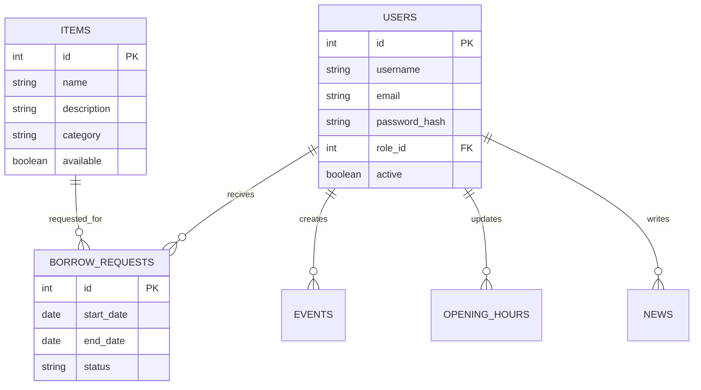

# Fachschafts-Webapplikation

Dieses Projekt ist eine Webapplikation für die Fachschaft, die im Rahmen der
Portfolioprüfung im Fach **Cloud Computing** entwickelt wird.

Die Anwendung besteht aus einem **Node.js + Express Backend** und einem
**Astro-Frontend mit SolidJS** und deckt die Render-Methoden **SSG, SSR und SPA** ab.

---

## 📌 Projektidee

Die Webapplikation bietet:

- Öffentliche Informationsseiten über die Fachschaft
- Eine Übersicht über anstehende Events
- Anzeige der aktuellen Büro-Öffnungszeiten
- Eine Inventarübersicht mit Möglichkeit, Gegenstände auszuleihen
- Einen geschützten Verwaltungsbereich für Mitglieder und Vorstand

---

## 🧱 Architekturübersicht

---

## Datenmodell

