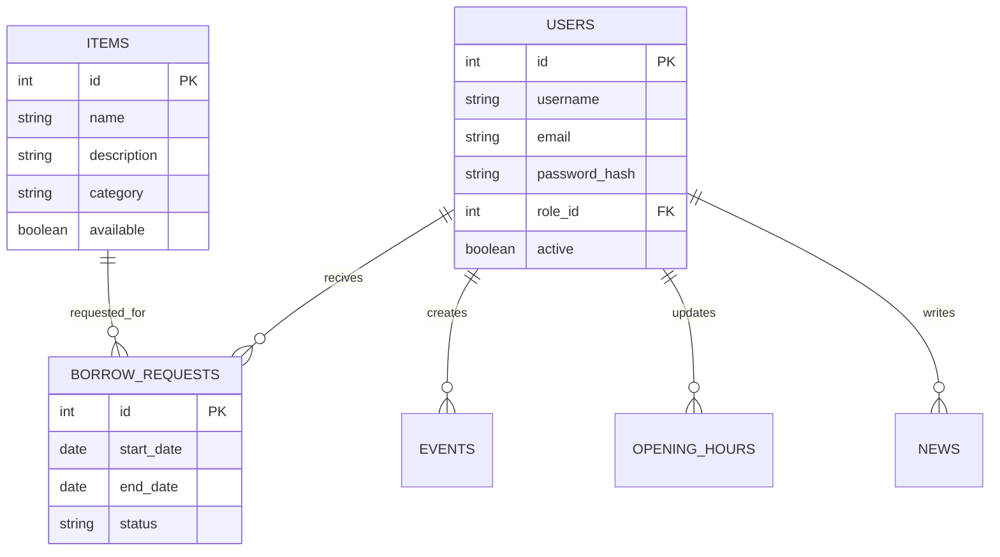

# Fachschafts-Webapplikation

Dieses Projekt ist eine Webapplikation für die Fachschaft, die im Rahmen der
Portfolioprüfung im Fach **Cloud Computing** entwickelt wird.

Die Anwendung besteht aus einem **Node.js + Express Backend** und einem
**Astro-Frontend mit SolidJS** und deckt die Render-Methoden **SSG, SSR und SPA** ab.

---

## 📌 Projektidee

Die Webapplikation bietet:

- Öffentliche Informationsseiten über die Fachschaft
- Eine Übersicht über anstehende Events
- Anzeige der aktuellen Büro-Öffnungszeiten
- Eine Inventarübersicht mit Möglichkeit, Gegenstände auszuleihen
- Einen geschützten Verwaltungsbereich für Mitglieder und Vorstand

---

## 🧱 Architekturübersicht

---

## Datenmodell

--- 

# Routen

Basis-Pfade gemäß app.js:
- /health
- /auth
- /user
- /events
- /inventory
- /borrow

### /health
- GET /health

### /auth
- POST /auth/register
- POST /auth/login

### /user
- GET /user/me
- GET /user
- GET /user/:username
- DELETE /user/:username
- PUT /user/change-password
- PUT /user/change-username
- PUT /user/change-role

### /events
- POST /events/events
- GET /events/events
- GET /events/events/:id
- PUT /events/events/:id
- DELETE /events/events/:id

### /inventory
- GET /inventory
- GET /inventory/available
- GET /inventory/categories
- GET /inventory/:id
- POST /inventory
- PATCH /inventory/:id
- DELETE /inventory/:id

### /borrow
- POST /borrow/borrow-request
- GET /borrow/borrow-requests
- GET /borrow/borrow-requests/:id
- DELETE /borrow/borrow-requests/:id
- POST /borrow/borrow-requests/:id/approve
- POST /borrow/borrow-requests/:id/reject
- PUT /borrow/borrow-requests/:id/return

### (noch nicht in app.js eingebunden)

#### /opening-hours
- POST /opening-hours
- GET /opening-hours
- PUT /opening-hours/:id
- DELETE /opening-hours/:id

#### /shifts
- GET /shifts
- GET /shifts/:id
- POST /shifts
- PUT /shifts/:id
- DELETE /shifts/:id
- POST /shifts/:id/join
- POST /shifts/:id/leave