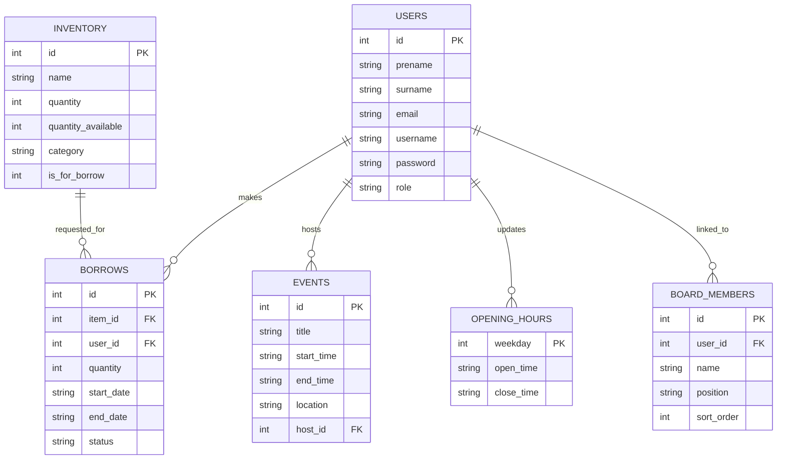

# Fachschafts-Webapplikation

Webapplikation für die Fachschaft, entwickelt im Rahmen der Portfolioprüfung
im Fach **Cloud Computing**.

Die Anwendung besteht aus einem **Node.js + Express Backend** und einem
**Astro-Frontend mit SolidJS** und deckt die Render-Methoden **SSG, SSR und SPA** ab.

---

## Projektbeschreibung

<!-- TODO: 2-3 Sätze, was die App macht und für wen -->

Die Webapplikation bietet:

- Öffentliche Informationsseiten über die Fachschaft
- Eine Übersicht über anstehende Events
- Anzeige der aktuellen Büro-Öffnungszeiten
- Eine Inventarübersicht mit Möglichkeit, Gegenstände auszuleihen
- Einen geschützten Verwaltungsbereich für Mitglieder und Admins

---

## Setup & Start

### Backend

```bash
cd backend
npm install
cp .env.example .env   # Werte bei Bedarf anpassen
npm run dbinit          # Datenbank initialisieren
npm run seed:test-data            # optional: Testdaten einspielen
npm run dev              # Server mit nodemon starten
```

Läuft standardmäßig auf `http://localhost:3000`.

### Frontend

```bash
cd frontend
npm install
npm run dev
```

Läuft standardmäßig auf `http://localhost:4321`.

<!-- TODO: Env-Variablen fürs Frontend ergänzen, falls vorhanden -->

---

## Funktionen / Pages

| Page | Pfad | Beschreibung |
|---|---|---|
| Startseite | `/` | Homepage für ersten Eindruck und Übersicht |
| Fachschaft | `/fachschaft` | Beschreibung der Fachschat, zugehörigen Studiengängen und Mitglieder|
| Events | `/events` | Übersicht über Anstehende Evensts|
| Inventar | `/inventory` | Liste aller Inventar-Items + Ausleih Möglichkeit|
| Öffnungszeiten | `/office-hours` | Übersicht der Öfnugszeiten der Woche|
| Login | `/login` | Login nur für Mitglieder und Admins|
| Admin-Bereich | `/admin` | Admin bereich über diesen Events,Inventar,Verleih, Öffnungszeiten und Mitglieder verwaltet werden können. (Admins hben mehr möglichkeiten)|
| Impressum | `/impressum` | Kontaktinformationen|
| Datenschutz | `/datenschutz` | Datenschutzhinweise|

---

## Datenmodell


```mermaid
erDiagram
    USERS ||--o{ BORROWS : makes
    INVENTORY ||--o{ BORROWS : requested_for
    USERS ||--o{ EVENTS : hosts
    USERS ||--o{ OPENING_HOURS : updates
    USERS ||--o{ BOARD_MEMBERS : linked_to

    USERS {
        int id PK
        string prename
        string surname
        string email
        string username
        string password
        string role
    }

    INVENTORY {
        int id PK
        string name
        int quantity
        int quantity_available
        string category
        int is_for_borrow
    }

    BORROWS {
        int id PK
        int item_id FK
        int user_id FK
        int quantity
        string start_date
        string end_date
        string status
    }

    EVENTS {
        int id PK
        string title
        string start_time
        string end_time
        string location
        int host_id FK
    }

    OPENING_HOURS {
        int weekday PK
        string open_time
        string close_time
    }

    BOARD_MEMBERS {
        int id PK
        int user_id FK
        string name
        string position
        int sort_order
    }
```

> Vollständige Feldliste und API-Routen: siehe [docs/api-doku.md](docs/api-doku.md)
