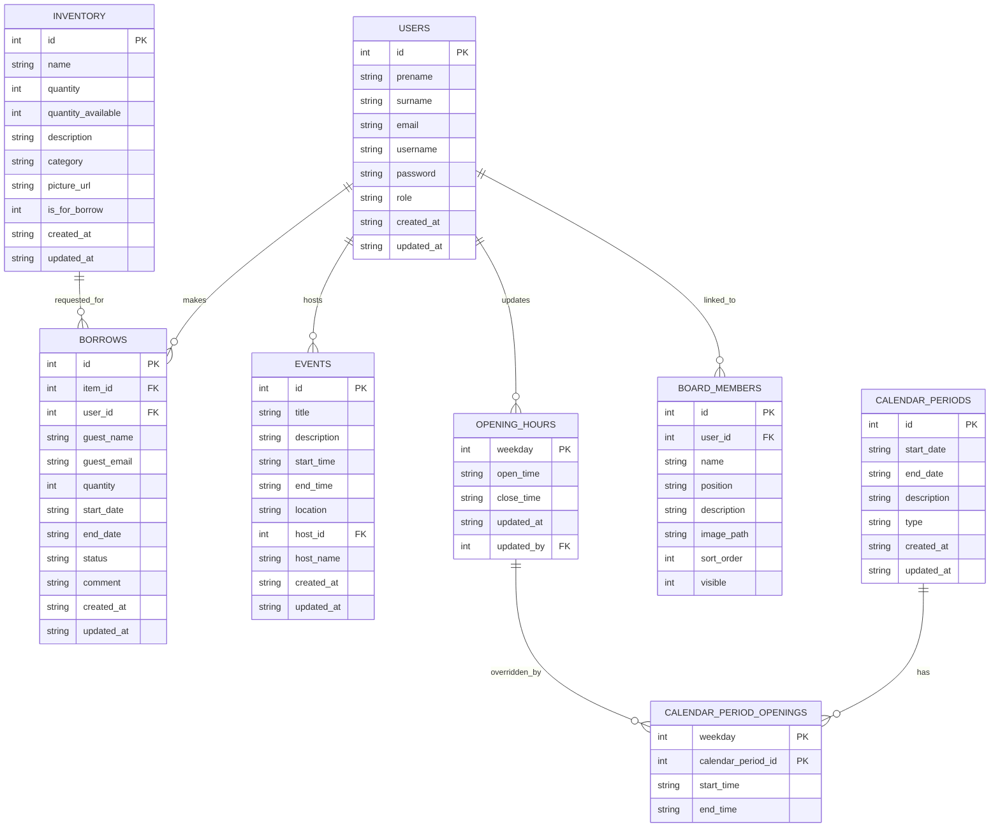

# Fachschafts-Webapplikation

Dieses Projekt ist eine Webapplikation für die Fachschaft, die im Rahmen der
Portfolioprüfung im Fach **Cloud Computing** entwickelt wird.

Die Anwendung besteht aus einem **Node.js + Express Backend** und einem
**Astro-Frontend mit SolidJS** und deckt die Render-Methoden **SSG, SSR und SPA** ab.

---

## 📌 Projektidee

Die Webapplikation bietet:

- Öffentliche Informationsseiten über die Fachschaft
- Eine Übersicht über anstehende Events
- Anzeige der aktuellen Büro-Öffnungszeiten
- Eine Inventarübersicht mit Möglichkeit, Gegenstände auszuleihen
- Einen geschützten Verwaltungsbereich für Mitglieder und Vorstand

---

## 🧱 Architekturübersicht

---

## Datenmodell

```mermaid
erDiagram
    USERS ||--o{ BORROWS : makes
    INVENTORY ||--o{ BORROWS : requested_for
    USERS ||--o{ EVENTS : hosts
    USERS ||--o{ OPENING_HOURS : updates
    USERS ||--o{ BOARD_MEMBERS : linked_to
    CALENDAR_PERIODS ||--o{ CALENDAR_PERIOD_OPENINGS : has
    OPENING_HOURS ||--o{ CALENDAR_PERIOD_OPENINGS : overridden_by

    USERS {
        int id PK
        string prename
        string surname
        string email
        string username
        string password
        string role
        string created_at
        string updated_at
    }

    INVENTORY {
        int id PK
        string name
        int quantity
        int quantity_available
        string description
        string category
        string picture_url
        int is_for_borrow
        string created_at
        string updated_at
    }

    BORROWS {
        int id PK
        int item_id FK
        int user_id FK
        string guest_name
        string guest_email
        int quantity
        string start_date
        string end_date
        string status
        string comment
        string created_at
        string updated_at
    }

    EVENTS {
        int id PK
        string title
        string description
        string start_time
        string end_time
        string location
        int host_id FK
        string host_name
        string created_at
        string updated_at
    }

    OPENING_HOURS {
        int weekday PK
        string open_time
        string close_time
        string updated_at
        int updated_by FK
    }

    CALENDAR_PERIODS {
        int id PK
        string start_date
        string end_date
        string description
        string type
        string created_at
        string updated_at
    }

    CALENDAR_PERIOD_OPENINGS {
        int weekday PK
        int calendar_period_id PK
        string start_time
        string end_time
    }

    BOARD_MEMBERS {
        int id PK
        int user_id FK
        string name
        string position
        string description
        string image_path
        int sort_order
        int visible
    }
```

---

# Routen

Basis-Pfade gemäß `app.js`:
- `/auth`
- `/user`
- `/events`
- `/inventory`
- `/borrows`
- `/opening-hours`
- `/calendar-periods`
- `/board-members`

### /auth
- `POST /auth/register`
- `POST /auth/login/username`
- `POST /auth/login/email`
- `GET  /auth/me` 🔒

### /user
- `GET    /user/me` 🔒
- `GET    /user` 🔒
- `GET    /user/id/:id` 🔒
- `GET    /user/username/:username` 🔒
- `GET    /user/email/:email` 🔒
- `DELETE /user/username/:username` 🔒 Admin
- `PUT    /user/change-password` 🔒
- `PUT    /user/change-role` 🔒 Admin

### /events
- `GET    /events`
- `GET    /events/:id`
- `POST   /events` 🔒 Admin
- `PUT    /events/:id` 🔒 Admin
- `DELETE /events/:id` 🔒 Admin

### /inventory
- `GET    /inventory`
- `GET    /inventory/available`
- `GET    /inventory/categories/:category`
- `GET    /inventory/:id`
- `POST   /inventory` 🔒 Admin
- `PATCH  /inventory/:id` 🔒 Admin
- `DELETE /inventory/:id` 🔒 Admin

### /borrows
- `GET  /borrows` 🔒
- `POST /borrows/user` 🔒
- `POST /borrows/guest`
- `PUT  /borrows/:id/approve` 🔒 Admin
- `PUT  /borrows/:id/reject` 🔒 Admin
- `PUT  /borrows/:id/return` 🔒 Admin
- `DELETE /borrows/:id` 🔒 Admin

### /opening-hours
- `GET /opening-hours`
- `GET /opening-hours/:day_of_week`
- `PUT /opening-hours/:day_of_week` 🔒 Admin

### /calendar-periods
- `GET    /calendar-periods`
- `GET    /calendar-periods/:id`
- `POST   /calendar-periods` 🔒 Admin
- `PUT    /calendar-periods/:id` 🔒 Admin
- `DELETE /calendar-periods/:id` 🔒 Admin
- `POST   /calendar-periods/period-openings/:weekday` 🔒 Admin
- `GET    /calendar-periods/period-openings/:weekday/:period_id`

### /board-members
- `GET    /board-members`
- `GET    /board-members/all` 🔒 Admin
- `POST   /board-members` 🔒 Admin
- `POST   /board-members/upload` 🔒 Admin
- `PUT    /board-members/:id` 🔒 Admin
- `DELETE /board-members/:id` 🔒 Admin

---

> 🔒 = JWT erforderlich · **Admin** = zusätzlich Admin-Rolle erforderlich